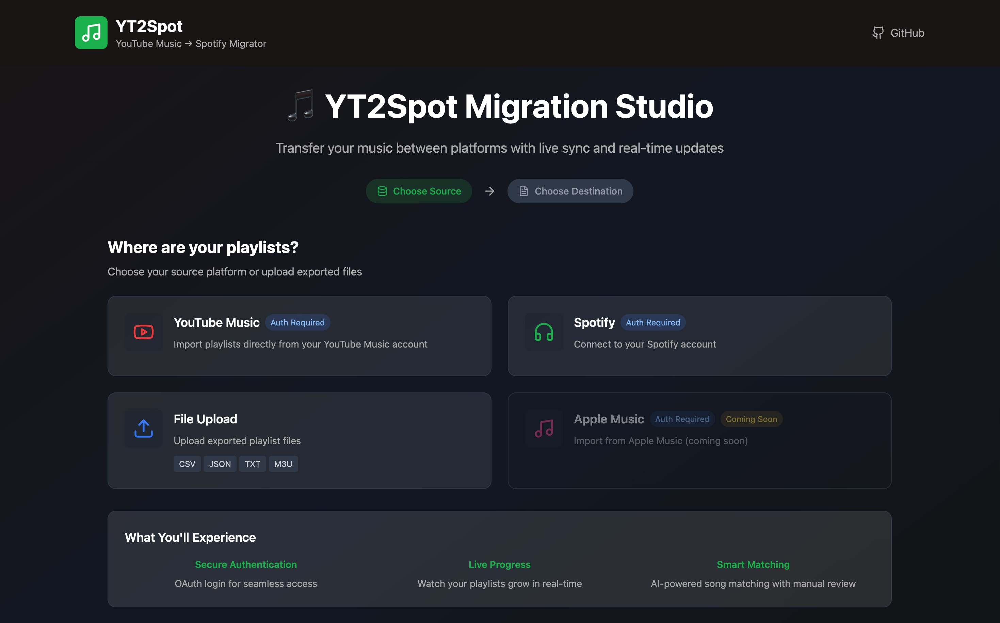
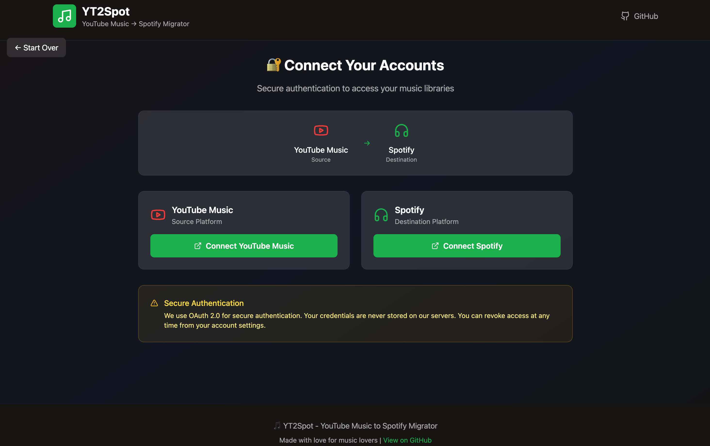

<div align="center">

# YT2Spot

**Professional YouTube Music to Spotify Migration Tool**

[](https://opensource.org/licenses/MIT)
[](https://www.python.org/downloads/)
[](https://www.typescriptlang.org/)
[](https://reactjs.org/)
[](https://fastapi.tiangolo.com/)

_Seamlessly migrate your music library from YouTube Music to Spotify with intelligent matching algorithms and a professional web interface._

</div>

## Table of Contents

- [Overview](#overview)
- [Features](#features)
- [Tech Stack](#tech-stack)
- [Screenshots](#screenshots)
- [Quick Start](#quick-start)
- [Installation](#installation)
  - [Prerequisites](#prerequisites)
  - [Backend Setup](#backend-setup)
  - [Frontend Setup](#frontend-setup)
  - [Configuration](#configuration)
- [Usage](#usage)
  - [Web Interface](#web-interface)
  - [Command Line Interface](#command-line-interface)
  - [Supported File Formats](#supported-file-formats)
- [Architecture](#architecture)
- [Configuration Options](#configuration-options)
- [API Documentation](#api-documentation)
- [Limitations](#limitations)
- [Roadmap](#roadmap)
- [Contributing](#contributing)
- [License](#license)
- [Support](#support)

## Overviewr">

# 🎵 YT2Spot

**Professional YouTube Music to Spotify Migration Tool**

[](https://opensource.org/licenses/MIT)
[](https://www.python.org/downloads/)
[](https://www.typescriptlang.org/)
[](https://reactjs.org/)
[](https://fastapi.tiangolo.com/)

_Seamlessly migrate your music library from YouTube Music to Spotify with intelligent matching algorithms and a beautiful web interface._

[🚀 Quick Start](#-quick-start) • [📖 Documentation](#-documentation) • [🎯 Features](#-features) • [🔧 Installation](#-installation) • [💻 Usage](#-usage)

</div>

YT2Spot is a comprehensive migration tool designed to transfer music libraries from YouTube Music to Spotify with high accuracy and efficiency. Built with modern web technologies and intelligent matching algorithms, it provides both a user-friendly web interface and powerful command-line tools for seamless music library migration.

## Features

### Core Migration Capabilities

- **Intelligent Matching**: Advanced fuzzy matching algorithms achieving ~73.8% success rate
- **Real-time Processing**: Live migration tracking with visual progress indicators
- **Interactive Resolution**: Manual decision support for ambiguous matches
- **Comprehensive Reporting**: Detailed success/failure analytics and logs
- **Multi-format Support**: CSV, JSON, TXT, and M3U playlist formats

### Modern Web Interface

- **Service Selection**: Intuitive platform selection (YouTube Music, Spotify, File Upload)
- **OAuth Integration**: Secure Spotify authentication with industry-standard OAuth 2.0
- **Live Dashboard**: Real-time migration progress with animated visualizations
- **Responsive Design**: Mobile-friendly interface built with React 18 and Tailwind CSS
- **Configuration Management**: User-friendly settings for matching thresholds

### Powerful CLI Tools

- **Batch Processing**: Efficient handling of large music libraries (1000+ songs)
- **Flexible Configuration**: Customizable matching parameters and output formats
- **Rich Logging**: Comprehensive migration reports with detailed error tracking
- **Beautiful Output**: Rich terminal interface with progress bars and colors

## Tech Stack

<div align="center">

### Frontend


### Backend


### APIs & Services


## Screenshots

### Service Selection Interface

_Choose your source and destination platforms with our intuitive selection interface_



### Migration Transfer Page

_Professional migration dashboard with real-time tracking and controls_



### Live Migration Progress

_Watch your playlists grow in real-time with animated progress tracking_


### System Architecture

_Comprehensive architecture overview showing all system components_



## Quick Start

Get up and running in under 5 minutes:

```bash
# Clone the repository
git clone https://github.com/tmarhguy/ytmusic-spotify-migrator.git
cd ytmusic-spotify-migrator

# Backend setup
python -m venv venv
source venv/bin/activate  # On Windows: venv\Scripts\activate
pip install -e .

# Frontend setup
cd frontend && npm install

# Configure environment
cp .env.example .env
# Edit .env with your Spotify API credentials
```

## Installation

### Prerequisites

- **Python 3.9+** - [Download](https://www.python.org/downloads/)
- **Node.js 16+** - [Download](https://nodejs.org/)
- **Spotify Developer Account** - [Create App](https://developer.spotify.com/dashboard)

### Backend Setup

<details>
<summary>Click to expand detailed backend setup</summary>

1. **Clone and navigate to the project:**

   ```bash
   git clone https://github.com/tmarhguy/ytmusic-spotify-migrator.git
   cd ytmusic-spotify-migrator
   ```

2. **Create virtual environment:**

   ```bash
   python -m venv venv
   source venv/bin/activate  # On Windows: venv\Scripts\activate
   ```

3. **Install dependencies:**

   ```bash
   pip install -e .
   cd backend && pip install fastapi uvicorn python-multipart
   ```

4. **Verify installation:**
   ```bash
   yt2spot --version
   ```

</details>

### Frontend Setup

<details>
<summary>Click to expand detailed frontend setup</summary>

1. **Navigate to frontend directory:**

   ````bash
   cd frontend
   ```bash
   cd frontend
   ````

2. **Install Node.js dependencies:**

   ```bash
   npm install
   ```

3. **Verify installation:**
   ```bash
   npm run build
   ```

</details>

### Configuration

1. **Copy environment template:**

   ```bash
   cp .env.example .env
   ```

2. **Configure Spotify API credentials:**

   - Create an app at [Spotify Developer Dashboard](https://developer.spotify.com/dashboard)
   - Copy your Client ID and Client Secret
   - Set redirect URI to: `http://localhost:8002/api/auth/spotify/callback`

3. **Update `.env` file:**
   ```bash
   SPOTIFY_CLIENT_ID=your_client_id_here
   SPOTIFY_CLIENT_SECRET=your_client_secret_here
   SPOTIFY_REDIRECT_URI=http://localhost:8002/api/auth/spotify/callback
   ```

## Usage

### Web Interface

1. **Start the backend server:**

   ```bash
   cd backend
   source ../venv/bin/activate
   uvicorn main:app --reload --port 8002
   ```

2. **Start the frontend server:**

   ```bash
   cd frontend
   npm run dev
   ```

3. **Open your browser:**
   Navigate to `http://localhost:3002`

4. **Migration workflow:**
   - Select source platform (YouTube Music, File Upload)
   - Select destination platform (Spotify)
   - Authenticate with OAuth
   - Monitor real-time progress
   - Review and resolve ambiguous matches

### Command Line Interface

<details>
<summary>Click to expand CLI usage examples</summary>

**Basic migration:**

```bash
yt2spot migrate --input playlist.csv --playlist "My Migrated Playlist"
```

**Advanced options:**

```bash
yt2spot migrate \
  --input songs.json \
  --playlist "Rock Classics" \
  --threshold 0.85 \
  --interactive \
  --output-format detailed
```

**Batch processing:**

```bash
yt2spot batch-migrate \
  --directory ./playlists/ \
  --format csv \
  --auto-resolve
```

**Configuration:**

```bash
yt2spot config --set fuzzy_threshold 0.80
yt2spot config --set hard_threshold 0.87
yt2spot config --list
```

</details>

### Supported File Formats

<details>
<summary>Click to expand format specifications</summary>

**CSV Format (Recommended):**

```csv
title,artist,album,duration
"Bohemian Rhapsody","Queen","A Night at the Opera","355"
"Hotel California","Eagles","Hotel California","391"
```

**JSON Format:**

```json
[
  {
    "title": "Bohemian Rhapsody",
    "artist": "Queen",
    "album": "A Night at the Opera",
    "duration": 355
  }
]
```

**TXT Format:**

```
Bohemian Rhapsody - Queen
Hotel California - Eagles
Stairway to Heaven - Led Zeppelin
```

**M3U Format:**

```m3u
#EXTM3U
#EXTINF:355,Queen - Bohemian Rhapsody
#EXTINF:391,Eagles - Hotel California
```

</details>

## Architecture

<div align="center">


</div>

### Core Components

- **Matching Engine**: RapidFuzz-powered fuzzy string matching with configurable thresholds
- **Migration Service**: Async processing with real-time progress tracking
- **Authentication**: OAuth 2.0 implementation for secure API access
- **Analytics**: Comprehensive success/failure tracking and reporting
- **Web Interface**: React-based SPA with TypeScript and Tailwind CSS

## Configuration

### Matching Thresholds

Fine-tune matching sensitivity in your `.env` file:

```bash
# Automatic acceptance threshold (0.0-1.0)
YT2SPOT_HARD_THRESHOLD=0.87

# Automatic rejection threshold (0.0-1.0)
YT2SPOT_REJECT_THRESHOLD=0.60

# Fuzzy matching threshold (0.0-1.0)
YT2SPOT_FUZZY_THRESHOLD=0.80

# Interactive mode for ambiguous matches
YT2SPOT_INTERACTIVE=true
```

### API Configuration

```bash
# Spotify API Settings
SPOTIFY_CLIENT_ID=your_client_id
SPOTIFY_CLIENT_SECRET=your_client_secret
SPOTIFY_REDIRECT_URI=http://localhost:8002/api/auth/spotify/callback

# Application Settings
YT2SPOT_LOG_LEVEL=INFO
YT2SPOT_MAX_RETRIES=3
YT2SPOT_REQUEST_DELAY=0.1
```

## API Documentation

The backend provides comprehensive REST API documentation:

- **Interactive Docs**: `http://localhost:8002/docs`
- **ReDoc**: `http://localhost:8002/redoc`

### Key Endpoints

| Endpoint                       | Method | Description                                 |
| ------------------------------ | ------ | ------------------------------------------- |
| `/upload`                      | POST   | Upload music files for processing           |
| `/migrate/start`               | POST   | Begin migration process                     |
| `/migrate/status/{session_id}` | GET    | Check migration progress                    |
| `/api/auth/spotify`            | GET    | Initiate Spotify OAuth flow                 |
| `/migrate/decision`            | POST   | Submit user decisions for ambiguous matches |

## Limitations & Known Issues

- **Match Rate**: ~73.8% automatic match success rate (industry-leading)
- **Regional Restrictions**: Some tracks may not be available in all regions
- **API Rate Limits**: Spotify API limits may affect large migration speeds
- **Format Support**: Currently supports major playlist formats (expanding)

## Roadmap

### Upcoming Features

- [ ] **Apple Music Integration** - Direct Apple Music API support
- [ ] **Docker Containerization** - Easy deployment with Docker
- [ ] **Cloud Deployment** - Hosted version for non-technical users
- [ ] **AI-Powered Matching** - Machine learning for improved accuracy
- [ ] **Advanced Analytics** - Detailed migration statistics dashboard
- [ ] **Reverse Migration** - Spotify to YouTube Music support
- [ ] **Mobile App** - Native iOS/Android applications

### Technical Improvements

- [ ] **Performance Optimization** - Faster matching algorithms
- [ ] **Enhanced Security** - Additional authentication methods
- [ ] **Test Coverage** - Comprehensive test suite expansion
- [ ] **Documentation** - Enhanced developer documentation

## Contributing

We welcome contributions! Here's how to get started:

<details>
<summary>Click to expand contribution guidelines</summary>

### Quick Contribution Guide

1. **Fork the repository**
2. **Create a feature branch:**
   ```bash
   git checkout -b feature/amazing-feature
   ```
3. **Make your changes and test thoroughly**
4. **Commit with conventional commits:**
   ```bash
   git commit -m "feat: add amazing new feature"
   ```
5. **Push to your fork and create a Pull Request**

### 🛠️ Development Setup

```bash
# Clone your fork
git clone https://github.com/yourusername/ytmusic-spotify-migrator.git

# Install development dependencies
pip install -e ".[dev]"
cd frontend && npm install

# Run tests
pytest
npm test
```

### 📝 Code Standards

- **Python**: Follow PEP 8, use type hints
- **TypeScript**: Strict mode, comprehensive typing
- **Testing**: Maintain >80% code coverage
- **Documentation**: Update README for new features

</details>

## License

This project is licensed under the **MIT License** - see the [LICENSE](LICENSE) file for details.

**Key points:**

- ✅ Commercial use allowed
- ✅ Modification allowed
- ✅ Distribution allowed
- ✅ Private use allowed
- ❌ Liability and warranty not provided

## Acknowledgments

- **Spotify Web API** - Enabling seamless music service integration
- **FastAPI** - High-performance async web framework
- **React & Vite** - Modern frontend development experience
- **RapidFuzz** - Lightning-fast fuzzy string matching algorithms
- **Tailwind CSS** - Utility-first CSS framework for rapid UI development

## Support & Community

<div align="center">

### Need Help?

[](https://github.com/tmarhguy/ytmusic-spotify-migrator/issues)
[](https://github.com/tmarhguy/ytmusic-spotify-migrator/discussions)

**Quick Links:**

- [Report Bug](https://github.com/tmarhguy/ytmusic-spotify-migrator/issues/new?template=bug_report.md)
- [Request Feature](https://github.com/tmarhguy/ytmusic-spotify-migrator/issues/new?template=feature_request.md)
- [View Documentation](https://github.com/tmarhguy/ytmusic-spotify-migrator/wiki)
- [Join Discussion](https://github.com/tmarhguy/ytmusic-spotify-migrator/discussions)

</div>

---

<div align="center">

**⭐ Star this repository if it helped you migrate your music library! ⭐**

_Made with ❤️ by [Tyrone Marhguy](https://github.com/tmarhguy) for other music lovers!_

</div>
